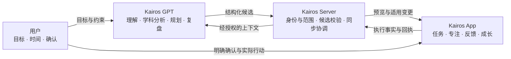

# Kairos

### 让目标、规划与真实行动连成一个系统。

**Kairos 是由 App、服务器与 GPT 多端协同组成的 AI 学习与执行系统。** 它围绕一个问题展开：AI 帮忙制定计划之后，怎样把计划落实到日常行动，再让真实反馈影响下一次规划？

`Android / Kotlin` · `Jetpack Compose` · `Node.js` · `GPT 协作` · `学习与执行` · `持续开发中`

[产品导览](docs/product-walkthrough.md) · [系统架构](docs/system-design.md) · [工程案例](docs/engineering-decisions.md) · [验证与状态](docs/verification-and-status.md) · [后续方向](docs/roadmap.md)

> 这是独立的公开展示仓库，不是完整开源发行版。这里只发布经过整理的产品与技术文档；开发源码、真实学习数据和运行环境保持私有。文中示例均为说明用途，不是用户记录。

## 30 秒了解 Kairos

| 想了解什么 | 简短回答 |
| --- | --- |
| 面向什么场景？ | 需要长期学习、管理每日任务、保持专注，并持续调整计划的个人使用场景。 |
| 用户在其中做什么？ | 提出目标和约束、确认计划、开始行动、记录反馈，再根据真实情况调整。 |
| AI 做什么？ | 理解目标、形成候选计划、辅助学科分析与复盘；不能把一句建议直接当成已执行的事实。 |
| 为什么需要三个端？ | GPT 负责理解与推理，Server 负责受控连接和校验，App 负责设备交互与实际执行记录。 |
| 最值得看的技术点？ | 有确认边界的 AI 写入、多端状态一致性、学习证据语义、任务与奖励的重复处理保护、历史数据兼容。 |

## 从一个真实问题出发

计划工具通常知道“安排了什么”，计时器知道“用了多久”，聊天窗口知道“讨论过什么”，但它们并不天然知道彼此的状态。

这会产生几个具体问题：

- **计划与容量脱节**：安排很完整，却没有给当天的可用时间、突发事项和未完成任务留位置。
- **建议与执行脱节**：对话里已经说“调整好了”，实际任务可能还没更新。
- **打勾与学习效果混在一起**：做过、做完、做对、独立完成和真正掌握，被压缩成一个完成状态。
- **反馈无法用于下一轮规划**：专注时长、部分完成和实际困难没有回到计划环节。
- **长期使用中的工程问题**：网络重试、重复操作、升级迁移和系统权限变化，都可能影响用户对记录的信任。

Kairos 将这些问题放进同一条产品流程：

**目标与现实约束 → 候选计划 → 校验与确认 → 执行与记录 → 反馈与复盘 → 下一轮调整。**

## 一个 Kairos，三个协作端

这是整体协作设计，不代表所有链路均已在生产环境启用。各端的实际进展见[验证与状态](docs/verification-and-status.md)。

| 组成 | 核心职责 | 刻意保留的边界 |
| --- | --- | --- |
| **Kairos App** | 任务与日计划、专注、完成反馈、积分成长、应用守护，以及相应预览与确认界面。 | 业务变更经过既有规则与事务，不让对话绕过结算或数据规则。 |
| **Kairos Server** | Bridge / Runtime、角色与身份绑定、上下文读取、候选校验、版本与同步协调。 | 接口存在不等于已授权；服务端不自动拥有全部业务数据的写权限。 |
| **Kairos GPT** | 总控规划、学科协作、材料辅助分析、反馈解释和下一轮建议。 | 建议是候选；聊天记忆和模型判断不自动升级为真实学习记录。 |

## 产品能力地图

以下展示产品范围及其工程关注点；具体可用程度以状态页为准。

| 能力 | 用户价值 | 设计与实现关注点 |
| --- | --- | --- |
| **任务与日计划** | 将目标拆成今天可以开始的行动，支持持续调整。 | 任务与日期安排分开；注意排序、重复加入、延期与修改后的状态一致性。 |
| **专注与行动证据** | 记录实际投入，而不只保留一次“完成”点击。 | 计时、进度与打卡等证据语义；会话恢复、计时边界与重复结束。 |
| **执行反馈与学习记录** | 允许“做了一部分”和“尚未掌握”被准确表达。 | 完成程度、正确性、独立性和材料范围不能互相代替。 |
| **积分与成长** | 为持续行动提供反馈，让规则有可解释的依据。 | 既有领域规则、预览与结算、重复请求去重和增量差额处理。 |
| **应用守护** | 辅助管理分心应用与注意力。 | 权限状态、前台识别、限制状态与恢复路径；效果受设备和系统行为影响。 |
| **学习材料与上下文** | 让建议指向具体资料与有来源的信息。 | 材料身份和版本、适用范围、引用来源、缺失信息保留未知。 |
| **GPT 规划与复盘** | 按目标、时间和反馈提出可讨论的下一步。 | 总控与学科分工、容量检查、结构化候选、明确确认及回执。 |

## 一次使用过程，可以具体到什么程度？

以下是**虚构的产品流程示例**，用于理解各端协作，不是已录制的端到端演示。

> “今晚有 70 分钟，想继续上次的练习，但其中一部分还不熟悉。”

1. **明确约束**：区分已知的可用时间、已确认的进度和仍然未知的掌握情况。
2. **形成候选**：GPT 给出“回顾 15 分钟 + 练习 35 分钟 + 反馈 10 分钟”的建议，保留 10 分钟余量；材料范围不足时先补充，而不虚构题目编号。
3. **校验与预览**：系统检查容量、任务冲突和上下文版本。用户看到将新增或调整什么，再决定是否确认。
4. **进入执行**：适用的任务进入 App 日常流程，用户开始专注或记录进度。
5. **保留实际反馈**：如果最终只完成部分内容，就记录部分完成；没有正确性或独立作答证据时，不标记为掌握。
6. **调整下一轮**：下一次建议依据实际反馈，而不是把原计划当成已经完成的历史。

更完整的操作故事、异常分支与反馈示例见[产品导览](docs/product-walkthrough.md)。

## 这个项目的工程深度在哪里？

### 01 · AI 写入是一条业务流程，不是一句提示词

规划建议要经过准备、校验、预览和确认。提交还要检查版本与适用范围；服务端接受与设备成功应用也分别处理。这样才能解释“计划生成了，但没有生效”究竟发生在哪一步。

### 02 · 复用现有任务与奖励，不建立聊天里的第二套系统

跨端能力围绕既有任务、日计划、执行记录和领域规则接入。一个操作重试，不应该重复建任务或再次发奖励；学习反馈的更正，也不应该随意重写历史经济账。

### 03 · 保留学习证据之间的区别

“做完”是执行状态，“做对”是正确性，“独立完成”是帮助程度，“掌握”需要更充分的证据。把这些区别保留下来，才能避免 GPT 用一个含糊的完成标签做下一轮推理。

### 04 · 异常路径也是产品体验

网络中断、过期候选、版本冲突、计时恢复、权限失效与历史数据升级，并不是上线前才考虑的附加项。它们决定用户能否相信系统呈现的状态。

详见[工程案例与取舍](docs/engineering-decisions.md)，包含重复请求、部分完成、材料引用和升级兼容等案例。

## 技术结构

| 层 | 技术与组织方式 | 主要解决的问题 |
| --- | --- | --- |
| Android UI | Kotlin、Jetpack Compose / Material 3 | 日常操作、状态呈现、预览与确认。 |
| App 业务层 | UseCase、Repository、Coroutines / Flow、Hilt | 分离界面与规则，组织业务写入与可观察状态。 |
| 本地数据与后台工作 | Room、DataStore、WorkManager | 持久化、版本迁移、偏好与适用的后台任务。 |
| Server | Node.js、Bridge / Runtime、结构化契约 | 角色与范围校验、候选生命周期、授权同步。 |
| GPT 协作 | 总控角色、学科角色、输入输出契约 | 目标理解、材料分析、规划与反馈解释。 |
| 质量保障 | 领域单元测试、适配测试、Schema / Migration 检查、设备验证 | 分别检查规则、数据边界、跨端契约与真实设备行为。 |

这里展示技术选择与分层，不公开内部端点、授权参数或生产部署配置。

## 当前进展：已有内容与后续验证分开看

**截至 2026-09-27 的展示材料整理范围：**

- **App**：本地工程包含任务、专注、奖励、应用守护和学习相关模块及测试；本次文档整理没有重新构建或执行真机验收。
- **Server**：存在校验、同步、角色/身份及恢复相关实现与测试；验证环境能力不能直接等同于生产环境可用。
- **GPT / Learning Runtime**：已有角色规则、结构化契约、上下文与候选适配资料；历史隔离测试不能证明远端多会话已全部联通。
- **完整闭环**：需逐项核验授权、确认、提交、设备应用和反馈回流；不以单一接口成功代替全链路验收。

不公布未经当前复验支撑的测试通过数、性能提升或学习效果指标。详细依据类型、验证方法和限制集中在[验证与状态](docs/verification-and-status.md)。

## 阅读路线

| 读者 | 建议入口 | 可以看到什么 |
| --- | --- | --- |
| 想了解产品 | [产品导览](docs/product-walkthrough.md) | 具体使用故事、功能之间的关系、正常与异常流程。 |
| 想了解系统设计 | [系统架构](docs/system-design.md) | 三端职责、数据归属、候选写入时序和反馈方向。 |
| 想了解工程能力 | [工程案例](docs/engineering-decisions.md) | 真实问题、设计选择、取舍与需要验证的性质。 |
| 想判断项目成熟度 | [验证与状态](docs/verification-and-status.md) | 已有材料能说明什么、不能说明什么、如何进一步验收。 |
| 想了解后续发展 | [后续方向](docs/roadmap.md) | 公开演示、闭环核验、异常恢复与长期使用的工作重点。 |

## 关于展示与交流

这个仓库可以用于项目分享、简历链接和技术讨论。**Kairos 指整个 App + Server + GPT 系统，Kairos-Showcase 只是它的展示入口。**

当前展示以产品流程和技术文档为主，尚未发布可公开的真机截图或演示视频。后续演示将使用专用示例数据，不直接上传私人设备记录。这里也不提供完整源码、公开服务入口或安装包。

欢迎通过 [Issues](https://github.com/orin-builds/Kairos-Showcase/issues) 讨论产品和技术设计；请勿提交账号凭据或个人数据。
