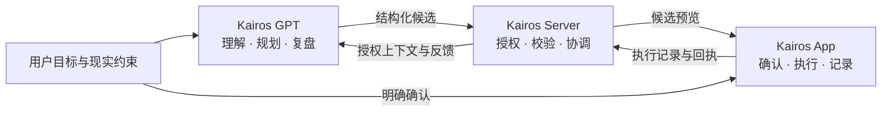

# Kairos

### 让目标、规划与真实行动连成一个系统。

**Kairos 是由 App、服务器与 GPT 多端协同组成的 AI 学习与执行系统。** 它把目标理解、学习规划、日常执行和反馈复盘连接起来，让计划能够被确认、执行和追踪，而不只停留在对话里。

`Android` · `Kotlin` · `Jetpack Compose` · `Node.js` · `GPT` · `多端协同`

这是 Kairos 的**公开项目展示仓库**，用于项目介绍与技术交流。完整开发仓库保持私有；这里不包含业务源码、账号凭据、个人学习记录或生产部署配置。

[公开展示主页](https://github.com/orin-builds/Kairos-Showcase) · [系统设计](docs/system-design.md) · [工程思路](docs/engineering-decisions.md)

## 项目解决什么问题

学习与个人执行往往分散在多个工具里：对话中形成计划，任务工具负责打勾，计时器记录时长，学习反馈又留在另一个地方。工具分别工作，却难以回答同一个问题：**计划是否真正执行，下一轮应该如何调整？**

Kairos 围绕一个循环组织这些能力：

> 目标与现实约束 → 候选规划 → 校验与确认 → 执行与记录 → 反馈与复盘 → 下一轮调整

## 一个 Kairos，三个协作端

| 组成 | 负责什么 | 在整体中的作用 |
| --- | --- | --- |
| **Kairos App** | 日常任务、专注、执行反馈、积分成长与应用守护。 | 将计划落实为行动，保留实际执行记录，并提供相应预览和确认界面。 |
| **Kairos Server** | Bridge / Runtime、受控接口、角色绑定、上下文访问、候选校验与同步协调。 | 连接 App 和 GPT，约束数据与操作边界，传递候选及回执。 |
| **Kairos GPT** | 目标理解、总控规划、学科协作、学习分析和复盘。 | 基于被授权的上下文形成建议，不把自然语言判断自动当成系统事实。 |

图中展示的是逻辑职责与协作设计，不代表所有生产链路已经完整验收。各端通过明确的数据归属与协议协作，并不共享一个跨进程原子事务。

## 核心产品场景

- **从目标到计划**：围绕目标、可用时间与实际约束形成候选，而不是生成无限增长的任务清单。
- **从计划到行动**：在 App 中承接任务、专注和执行反馈，让计划与日常操作连接。
- **从行动到成长**：通过已有业务规则处理积分、奖励和成长反馈，避免模型直接改写结算逻辑。
- **从记录到复盘**：把有来源的执行与学习证据反馈给规划环节，区分“完成了”与“真正掌握了”。
- **管理注意力**：通过应用守护等能力辅助减少分心，同时尊重系统权限和平台限制。

这些是项目的产品范围，不是对每个功能当前交付状态的逐项保证。

## 工程展示重点

**多端职责划分**：将推理、接口协调、设备执行和事实记录放在各自明确的边界内，不让任一端绕过其权限。

**可确认的写入链路**：区分候选、预览、用户确认、提交、设备应用和实际执行。模型生成成功，不等于业务操作已经完成。

**真实反馈与状态语义**：缺少上报保留为未知；完成任务不自动推断为答对、独立完成或掌握，避免错误事实继续污染规划。

**兼容性与可恢复性**：重视既有应用身份、数据迁移、重复请求处理与回执核对，避免为了接入 AI 重建一套平行业务系统。

## 技术方向

| 层 | 主要技术与组织方式 |
| --- | --- |
| App | Kotlin、Jetpack Compose / Material 3、Coroutines / Flow、Hilt、Room、DataStore、WorkManager。 |
| Server | Node.js、Bridge / Runtime、结构化接口契约、授权校验与同步协调。 |
| GPT | 总控与学科角色、结构化候选、受控上下文、材料引用和反馈协作。 |
| 质量保障 | 领域规则与适配层测试、接口契约校验、数据兼容检查、设备侧验证。 |

这里仅披露技术概览，不发布内部端点、私有协议实现、部署参数或访问凭据。

## 当前状态与展示边界

Kairos 正在持续开发与验证。本仓库提供经过整理的系统介绍和工程思路，**不是完整开源发行版，也不是生产就绪声明**。

- App、Server 和 GPT 都属于 Kairos；展示材料较多或较少不改变各端的项目归属。
- 尚未加入可公开的设备截图或演示视频，避免误用包含个人信息的开发证据。
- 不公开开发源码、运行日志、真实学习数据、数据库导出、密钥、设备标识或生产地址。
- 不编造性能提升、学习效果、用户规模或测试通过数量。

可通过本展示仓库的 Issues 交流项目设计，请勿在公开讨论中提交个人数据或凭据。
