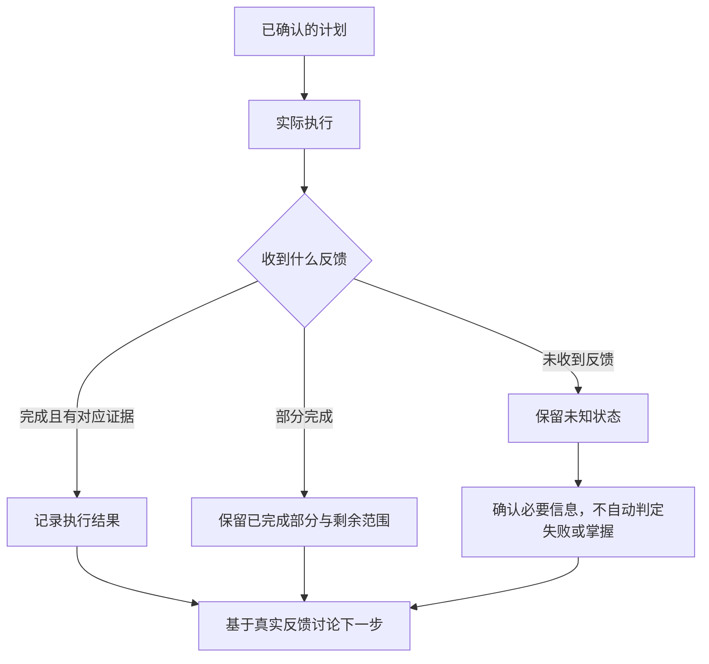

# Kairos · 产品导览

[项目首页](../README.md) · [系统架构](system-design.md) · [工程案例](engineering-decisions.md)

本页以虚构场景说明产品如何组织学习与行动。数字、任务与反馈均为演示设定，不对应真实用户，也不意味着完整流程已经通过生产验收。

## 1. 先决定今天能做什么，再讨论理想计划

用户说：“今晚有 70 分钟，想继续练习上次没理解的内容。”

这句话包含可用时间和意图，但没有证明具体材料范围、上次完成量或知识掌握程度。Kairos 的设计先区分这些信息：

| 信息 | 如何处理 | 为什么 |
| --- | --- | --- |
| 今晚可用 70 分钟 | 作为当前候选的时间约束。 | 计划必须落在现实容量之内。 |
| 想继续练习 | 作为学习意图。 | 意图不是已完成的事实。 |
| 上次没理解 | 作为用户描述，保留其来源。 | 不能直接推导错误率或能力等级。 |
| 具体章节和题目范围 | 在材料和已确认状态中核对，不足时询问。 | 避免模型编造任务范围。 |
| 已有日程 | 读取获授权的现有安排。 | 新任务不应忽略已有任务和冲突。 |

总控 GPT 负责综合目标与容量；学科 GPT 提供内容分析和建议。它们共享必要的授权上下文，但不靠互相复述建立第二套“真实记录”。

## 2. 看到的是可修改的候选，而不是已经替你执行的命令

一个候选可以这样解释：

| 阶段 | 演示时长 | 目的 |
| --- | ---: | --- |
| 回顾 | 15 分钟 | 找到上次不确定的概念。 |
| 练习 | 35 分钟 | 在确认材料范围后进行练习。 |
| 记录与反馈 | 10 分钟 | 标注做到哪里、是否借助讲解、仍有哪些困难。 |
| 保留余量 | 10 分钟 | 不把可用时间全部排满。 |

这是 70 分钟容量下的一种示例，不是 Kairos 的固定时间分配算法。

预览需要回答：新增哪些任务？改动哪些已有安排？依据是什么？还有哪些未知？用户可以确认、修改或不采用。候选过期或基础数据发生变化时，需要重新核对，不能沿用一份已经失效的预览。

## 3. App 将计划落实为日常操作

App 的价值在于承接持续交互：用户不必一直停留在聊天窗口，才能记录自己的行动。

| 操作领域 | 用户关心的事情 | 系统需要保留的区别 |
| --- | --- | --- |
| 任务与日计划 | 今天先做什么，什么可以延后？ | 任务本身与被安排到某一天不是同一概念。 |
| 专注 | 开始、暂停、继续、结束。 | 一次会话的状态与已经结算的证据不同。 |
| 进度反馈 | 完成了全部还是一部分？ | 部分完成不被硬改成全做完或全没做。 |
| 奖励与成长 | 这次行动带来了什么反馈？ | 有效证据与奖励规则有关，不由 GPT 随意给分。 |
| 应用守护 | 当前保护是否有效，如何处理异常？ | 配置存在不等于服务仍然正常工作。 |
| 洞察与复盘 | 计划和实际差在哪里？ | 原计划、实际投入和学习结果分别解释。 |

## 4. 一条反馈应该足够诚实

假设用户反馈：“做完了大部分，最后几题看了讲解，正确性还没核对。”

合适的解释是：

- 执行程度：部分完成，而不是全部完成。
- 帮助程度：至少部分内容使用过讲解，不能标为全程独立完成。
- 正确性：尚未核对，保留未知。
- 掌握程度：证据不足，不能仅根据耗时或打勾得出结论。
- 后续建议：定位未完成与仍不确定的范围，再决定复习或继续。

这比一个漂亮但含糊的“完成率”更适合成为下一轮学习规划的输入。

## 5. 计划没有按原样完成，也能继续前进

图中是逻辑流程，不是固定界面或已部署工作流。其核心是：不把“没有上报”变成“没有学习”，也不把“曾经安排”变成“已经做到”。

## 6. 异常情况也应能解释

| 情况 | 应有的处理原则 |
| --- | --- |
| 提交后网络中断 | 不直接声称失败或成功；核对请求身份、版本与回执，避免重复产生副作用。 |
| 用户连点确认 | 重复操作不能生成多份相同任务或重复结算。 |
| 预览之后改过日程 | 重新校验当前上下文，必要时重新预览和确认。 |
| GPT 无法取得真实进度 | 局部保留未知，不用示例数据或对话印象补全用户历史。 |
| 权限或应用守护失效 | 呈现真实状态和用户可操作的恢复路径。 |
| 用户后来更正学习反馈 | 保留来源与修订关系，不无依据地重放奖励历史。 |

这些是产品与工程的验收目标，各路径的具体实现和验证范围见[验证与状态](verification-and-status.md)。

## 7. 怎样演示这个项目

一份有说服力的演示，不只展示首页：

1. 展示一个虚构目标及其时间约束。
2. 展示候选方案、校验反馈和明确的确认动作。
3. 展示 App 中对应的任务与一次短执行记录。
4. 展示“部分完成 + 借助讲解”的真实语义，而不是全部打勾。
5. 展示下一轮建议如何使用这些反馈。
6. 补充一个异常分支，例如重复提交或版本冲突。

这份清单是后续演示的拍摄脚本，**不是已完成的视频或验收记录**。当前未公开真机媒体，也未提供可试用的在线服务。
