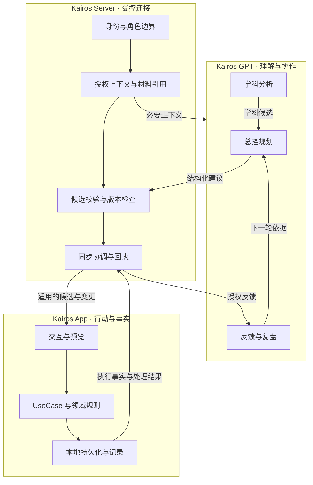
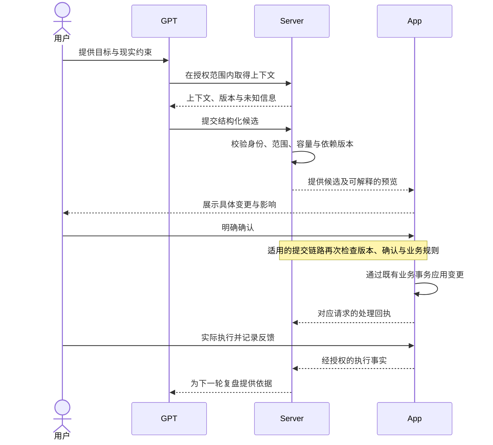

# Kairos · 系统架构

[项目首页](../README.md) · [产品导览](product-walkthrough.md) · [工程案例](engineering-decisions.md) · [验证与状态](verification-and-status.md)

## 1. 架构目标

Kairos 把理解、协调和执行分配给不同组件，同时保留统一的产品流程。

- **可行动**：规划应能映射到实际任务，而不只生成一段文字。
- **可确认**：用户看得懂将发生什么，并能明确决定是否采用。
- **可追溯**：事实、建议、执行和修订都有各自的来源与状态。
- **可恢复**：中断、重复、冲突和升级不能靠“再试一次”掩盖。
- **可限制**：模型、接口和后台组件只得到完成当前工作所需的权限。

## 2. 三端分层

图示为逻辑分层；箭头表示职责和信息方向，不表示每条生产连接均已启用，也不表示存在跨三个进程的统一数据库事务。

### App：界面不是业务规则本身

App 工程以界面、应用编排、领域模型、数据适配和持久化分层。Compose 负责呈现与交互；UseCase 组织业务动作；Repository 与 Room 等组件承接数据访问。

这样划分的意义是：无论动作来自普通界面还是跨端建议，最终都要经过适用的业务规则。接入 AI 不应额外生成一套积分公式、任务生命周期或事实存储。

### Server：中间层不等于无限权限

Bridge / Runtime 负责角色绑定、上下文访问、结构化输入校验及协调。现有工程还包含归档、队列、投影与恢复相关组件，这些能力有各自的适用边界和启用条件。

某个组件实现了接口，不意味着真实上游数据已经接通；身份验证通过，也不等于任意角色都能修改计划或学习状态。

### GPT：总控与学科角色各自解决不同问题

学科角色分析具体内容、材料范围与学习建议；总控角色综合目标、时间容量和候选之间的取舍。角色约束由实际绑定和调用链共同支撑，而不是让模型自行声明身份。

学科候选可以提供不同范围的替代方案。它们是供选择的选项，不能被总控无条件叠加成多份任务，更不能让一个学科角色擅自挤占其他内容的时间。

## 3. 哪些数据可以当作事实？

| 信息类别 | 主要来源或归属 | 不能混淆成什么 |
| --- | --- | --- |
| 目标与已确认上下文 | 既有持久化记录及其来源、版本。 | GPT 对目标的复述不等于新的用户确认。 |
| 任务与日安排 | 既有任务和日计划业务模型。 | 候选文字不等于任务已经写入。 |
| 执行记录 | 设备操作、有效证据、用户反馈。 | 安排过不等于做过；没有回报不等于没做。 |
| 学习证据 | 具体范围、反馈、来源及修订。 | 完成、正确、独立与掌握不能互相替代。 |
| 材料引用 | 材料身份、版本和授权范围。 | 知道资料名不等于读过指定内容。 |
| AI 推断 | 模型输出及所引用的上下文。 | 推断不是自动被认证的用户事实。 |
| 同步回执 | 对应阶段的接收或处理结果。 | 服务端接受不等于设备已应用，更不等于用户已执行。 |

上下文缺失时应保留局部未知。为了让界面显得“完整”而填补学习进度，会让后续规划持续使用错误前提。

## 4. 从候选到生效：概念时序

这是面向读者的简化概念时序，不是 wire protocol、公开 API 或部署拓扑。不同候选类型的实际提交路径与支持范围需要单独核验。

## 5. 为什么要记录候选依赖了哪些上下文？

一个候选可能同时依赖目标版本、材料版本、某天的可用时间和已经锁定的执行安排。只检查“计划本身没变”，仍可能漏掉它的前提已经变化。

现有上下文适配与契约资料采用**依赖读集**思路：记录实际使用的对象及版本，在确认的业务边界重新核对。其目标是让“基于旧信息生成的新计划”能够被识别，而不是静默覆盖当前安排。

读集也需要适当范围：读取全部学科、全部历史，不仅增加不必要的数据暴露，还可能使无关变更导致当前候选失效。

## 6. 中断与冲突如何看待

| 风险 | 对应的设计关注点 |
| --- | --- |
| 重复请求 | 稳定请求身份、幂等处理及结果核对。 |
| 数据已变化 | 乐观版本检查、依赖重读、重新规划或确认。 |
| 回执晚到 | 将接收、提交、应用和执行阶段分开记录。 |
| 后台任务中断 | 持久化状态、租约/游标与恢复边界。 |
| 权限已撤销 | 在实际访问与操作时检查权限，而不是只在首次登录检查。 |
| 材料不可用 | 限制相关候选，不伪造内容或无条件阻断其他学习。 |

这些机制分布在不同组件中，不能仅凭各模块有实现就宣称端到端已达到“恰好一次”或零故障。

## 7. 公开范围

本页披露架构思路、职责划分和设计取舍，不包含生产地址、内部凭据、用户数据、可调用接口契约或完整实现。验证材料的性质与限制见[验证与状态](verification-and-status.md)。
